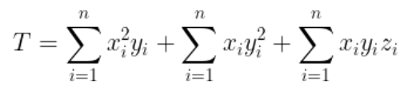

# CP-Practical Exam Sample Questions

### Thadomal Shahani Engineering College First Year Engineering Semester II C Programming Lab Sample Questions.

1. Write a program to find the area of a triangle.
2. Write a program to accept three numbers from the user and display the largest number.
3. Write a program to display the numbers from 1 to 100 that are divisible by 4 and 6.
4. Write a program to display the prime numbers in between 75 to 150.
5. Write a program to display the odd numbers from 1 to 100 that are not divisible by five.
6. Write a program to find the sum of natural numbers starting from 5 till the product of consecutive numbers is less than 400.
7.  Write a program to check the given number is even/odd, perfect square and prime
   number
8. Write a program to check whether the number is a part of Fibonacci series
9.  Write a program to find the sum of digits of a number.
10. Write a program to generate 3digit Armstrong numbers
11. Write a program to reverse a number.
12. Write a program to display the any given pattern.
13. Write a program to accept ‘n’ integers from the user into an array and display the sum and average of these integers.
14. Write a program to accept ‘n’ integers from the user into an array and display the count of even and odd integers.
15. Write a program to accept ‘n’ integers from the user into an array and find the
    largest/smallest integer.
16. Write a program to accept ‘n’ integers from the user into an array and sort the numbers in ascending/descending order.
17.  Write a program to calculate the sum and average of mxn matrix.
18.  Write a program to find the transpose of square matrix.
19. Write a program to multiply two matrices.
20. *No Question*
21. Write a program to find nCr.
22. Write a program to solve the following equation using function.
23. Write a program to demonstrate call by value and call by reference.
24. Write a program to create one dimensional array and usingfunction perform sort, search, delete, and insert operations. Use switch case for the choice of operation and while for continuation.
25. Write a program to store and display the name, roll number and total PCM marks for ‘n’ students. Generate a merit list with respect to the total marks scored. Display the output in tabular form in order of maximum total marks to minimum total marks.
26. Write a program to store the information of a person as his name, or ID number using union. Ask the user for the information choice.
27. Write a program to demonstrate five string functions.
28. Write a program that checks whether the entered string is a palindrome or not, without using string header file.
29. Write a program to accept a string and find the number of vowels in it.
30. Write a program to accept two strings, compare them and display whether they are equal or not. If not equal then display the string which is greater, without using built in functions.

[Source](https://github.com/anxkhn/CP-SAMPLE/files/8929495/CP-Practical.Exam.Sample.Questions.docx.pdf)

##### Please use it responsibly.

